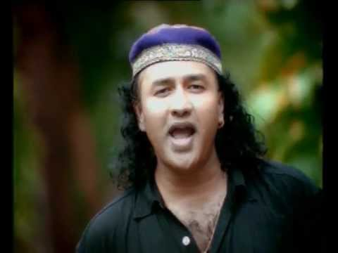

# Annu Music

Discord music player with a bit of spice :hot_pepper::hot_pepper:

Prefix for this bot is **annu**

> *Now supports slash commands!*

## Commands
* _play_: Plays your requested song
* _lplay_: Same as play, but plays the lyric video (helpful for music videos with a big intro)
* _irshad_: Get an authentic Annu Malik shayari!
* _connect_: Connects to voice channel
* _pause_: Pauses playback
* _resume_: Resumes playback
* _fuckoff_: Don't do this.

## Query Sources
- Spotify song URL/URI
- Youtube song link
- General song name

## Example
annu play https://www.youtube.com/watch?v=dQw4w9WgXcQ

## To-do
- [ ] Implement queue for songs

## Invite link
Invite Annubot to your server with [this link](https://discord.com/api/oauth2/authorize?client_id=826187328774733844&permissions=281894054160&scope=bot).

## .env Setup
You'll need a .env file in the same directory as this bot. The file format should be:

```
DISCORD_TOKEN = <your discord token>
SPOTIFY_ID = <your spotify id>
SPOTIFY_SECRET = <your spotify secret>
YT_KEY = <your google/youtube API key>
```